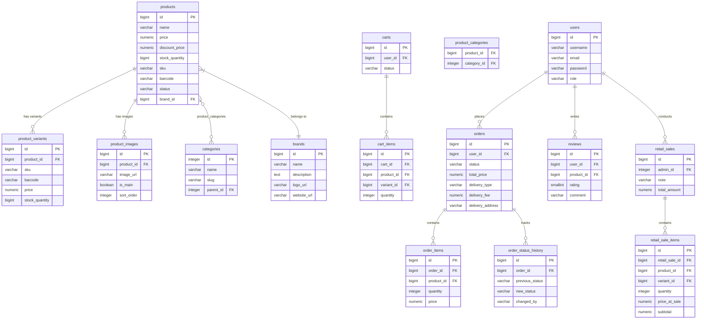

## Table of Contents

1. [Abstract](#1-abstract)
6. [Design](#6-design)
   - 6.2 [Database Design](#62-database-design)
8. [Implementation](#8-implementation)
   - 8.1 [Backend Implementation](#81-backend-implementation)
   - 8.2 [Admin Panel Implementation](#82-admin-panel-implementation)
   - 8.3 [Client Website Implementation](#83-client-website-implementation)
   - 8.4 [AI Recommendation Engine](#84-ai-recommendation-engine)
   - 8.5 [POS / Retail Sales Module](#85-pos--retail-sales-module)
   - 8.6 [KPI Dashboard](#86-kpi-dashboard)
   - 8.7 [Data Structures and CRUD Coverage](#87-data-structures-and-crud-coverage)

## 1. Abstract

Stationery is a full-stack platform for a stationery store that bridges online sales and offline point-of-sale operations within a single unified system. The backend, built on Spring Boot 4.0.3 with Java 17, exposes a RESTful API consumed by two front-end applications: an administrative panel and a customer-facing website accessible at [kanztovary.com](https://kanztovary.com). The system maintains a single shared inventory: customer orders placed online and retail transactions processed through the built-in POS terminal both deduct stock from the same database records. Additionally, the platform integrates Anthropic Claude AI (`claude-opus-4-7`) to provide intelligent product recommendations based on natural-language customer queries. Security is enforced through JWT-based authentication with role-based access control (`USER` and `ADMIN`). Database schema evolution is managed by Liquibase, and the API is documented via Springdoc OpenAPI (Swagger UI). This report describes the background, design decisions, implementation details, and test results of the project.


## 6. Design

### 6.2 Database Design

The data model contains sixteen tables. Key relationships are described below.

**Figure 3. Database entity-relationship diagram**
*(Insert the ERD screenshot here — the database diagram image from the project knowledge)*

The core entities and their relationships:



**Inventory shared-stock design.** Stock is decremented in a single `products.stock_quantity` field (and in `product_variants.stock_quantity` when a variant is specified). Both the `OrderServiceImpl` (online checkout) and `RetailSaleServiceImpl` (POS sale) write to the same columns inside a database transaction, which ensures consistency between channels.


## 8. Implementation

### 8.1 Backend Implementation

The backend entry point is a standard Spring Boot application class. All configuration is centralised in `application.properties`, with sensitive values (database credentials, Anthropic API key) injected through environment variables.

**Table 1. Technology stack**

| Layer | Technology | Version |
|---|---|---|
| Language | Java | 17 |
| Framework | Spring Boot | 4.0.3 |
| Security | Spring Security + JWT (jjwt) | 0.11.5 |
| Database | PostgreSQL | 14+ |
| ORM | Spring Data JPA / Hibernate | — |
| Migrations | Liquibase | — |
| AI Integration | Anthropic Java SDK | — |
| API Docs | Springdoc OpenAPI | 3.0.1 |
| Build | Maven | 3.8+ |

**Package structure:**

```
kg.stationery.stationeryv2
├── config
│   ├── datasource
│   │   ├── entity          ← JPA entities (User, Product, Order, …)
│   │   └── repository      ← Spring Data repositories + projections
│   └── security            ← JwtAuthFilter, SecurityFilterChain, JwtUtil
├── domain
│   ├── controller          ← REST controllers
│   ├── dto                 ← Request/Response DTOs per module
│   ├── enums               ← OrderStatus, ProductStatus, DeliveryType, KpiPeriod, …
│   ├── mapper              ← Entity ↔ DTO converters
│   ├── service             ← Service interfaces
│   │   └── impl            ← Service implementations
│   └── utils               ← Utility helpers
└── exception               ← Global exception handler
```

**Security configuration.** Public routes include `/auth/**`, `GET /products/**`, `GET /categories/**`, `GET /brands/**`, `GET /reviews/**`, `/uploads/**`, and the Swagger UI paths. All other routes require a valid JWT token. Admin-only routes additionally require the `ADMIN` role enforced via `@PreAuthorize("hasRole('ADMIN')")`.

### 8.2 Admin Panel Implementation

The admin panel (repository: `ItzEmirrr/KanztovaryAdmin`) is a browser-based single-page application that communicates with the Spring Boot backend via the REST API.

**Product management.** Administrators can create products with multiple images using a `multipart/form-data` request. The `data` part carries the JSON product body and the `images` part carries the image files.

*(Insert screenshot of the product creation screen — Figure 5)*

**Category and brand management.** Categories support a parent–child hierarchy through the `parent_id` self-referential foreign key. Each category has a `slug` field for URL-friendly identifiers.

**Order management.** Administrators can view all orders with filters by status, user, and date range. Status transitions are applied via `PUT /orders/{id}` and recorded in `order_status_history`.

**Table 3. API endpoint matrix (key endpoints)**

| Method | Path | Auth | Description |
|---|---|---|---|
| `POST` | `/auth/register` | Public | Register new user |
| `POST` | `/auth/login` | Public | Login, receive JWT |
| `GET` | `/products` | Public | Catalogue with filters and pagination |
| `GET` | `/products/{id}` | Public | Product detail |
| `GET` | `/products/barcode/{code}` | Admin | Barcode/SKU lookup for POS |
| `POST` | `/products` | Admin | Create product with images |
| `PUT` | `/products/{id}` | Admin | Update product |
| `DELETE` | `/products/{id}` | Admin | Delete product |
| `GET` | `/categories` | Public | List all categories |
| `POST` | `/categories` | Admin | Create category |
| `GET` | `/brands` | Public | List all brands |
| `POST` | `/brands` | Admin | Create brand |
| `GET` | `/cart` | User | View cart |
| `POST` | `/cart` | User | Add item to cart |
| `POST` | `/cart/checkout` | User | Convert cart to order |
| `GET` | `/orders/my` | User | User's order history |
| `GET` | `/orders` | Admin | All orders |
| `PUT` | `/orders/{id}` | Admin | Update order status |
| `POST` | `/retail-sales` | Admin | Conduct retail sale |
| `GET` | `/retail-sales` | Admin | Retail sale history |
| `DELETE` | `/retail-sales/{id}` | Admin | Delete sale (restores stock) |
| `POST` | `/recommendations` | Public | AI product recommendation |
| `GET` | `/admin/kpi` | Admin | KPI analytics |
| `GET` | `/reviews` | Public | List reviews for product |
| `POST` | `/reviews` | User | Submit review |
| `DELETE` | `/reviews/{id}` | User/Admin | Delete review |

### 8.3 Client Website Implementation

The client website (repository: `ItzEmirrr/KanztovaryClient`, live at [kanztovary.com](https://kanztovary.com)) provides the public-facing shopping experience.

Key screens include: the product catalogue with search, category filter, and brand filter; individual product detail pages with image gallery, variants, reviews, and an "Add to Cart" action; the cart and checkout flow with delivery type selection; order history; and the AI-powered product finder.

*(Insert screenshot of the product catalog — Figure 8)*

### 8.4 AI Recommendation Engine

The AI recommendation module is the most architecturally distinctive feature of the project. When a customer submits a natural-language query (e.g. "a fountain pen suitable for calligraphy under 3000 KGS"), the backend fetches up to 80 active products from the database, serialises them as a compact JSON catalogue, and sends both the catalogue and the query to `claude-opus-4-7` via the Anthropic Java SDK.

The system prompt is cached using Anthropic's prompt caching feature (`CacheControlEphemeral`), which reduces token costs on repeated calls because the system instruction block does not need to be re-evaluated for every request.

**Figure 11. AI recommendation service — key code fragment**

*(Insert screenshot of `AiRecommendationServiceImpl.java` — the `recommend()` method)*

```java
// Key excerpt from AiRecommendationServiceImpl.java
Message response = anthropicClient.messages().create(
    MessageCreateParams.builder()
        .model(MODEL)            // "claude-opus-4-7"
        .maxTokens(1024L)
        .systemOfTextBlockParams(List.of(
            TextBlockParam.builder()
                .text(SYSTEM_PROMPT)
                .cacheControl(CacheControlEphemeral.builder().build()) // Prompt caching
                .build()
        ))
        .addUserMessage(userMessage)   // Catalogue JSON + customer query
        .build()
);
```

The model returns a JSON object with a `summary` field (a short human-readable explanation of the selection) and a `recommendations` array containing `productId`, `name`, and `reason` for each suggested product. The backend parses this response and returns it to the client, which renders the recommended products with their reasons.

*(Insert screenshot of the AI recommendation result screen — Figure 9)*

### 8.5 POS / Retail Sales Module

The POS module allows an administrator logged into the admin panel to conduct an in-store sale without any separate cash register software.

Three input methods are supported for finding a product:

1. **Physical USB barcode scanner.** The scanner emulates a keyboard and sends the barcode string followed by Enter. The admin panel's input field intercepts this and calls `GET /products/barcode/{code}`.
2. **Webcam-based scanning.** The admin panel activates the device camera and decodes the barcode using a browser library, then calls the same backend endpoint.
3. **Manual name search.** The administrator types a partial product name and searches the catalogue.

Once products are added to the POS cart, the administrator completes the sale via `POST /retail-sales`. The backend decrements `stock_quantity` from the relevant product (or variant) records inside a database transaction and persists the `retail_sale` and `retail_sale_items` records.


```java
// From RetailSaleController.java
@PostMapping
@ResponseStatus(HttpStatus.CREATED)
public RetailSaleResponse create(
        @AuthenticationPrincipal User admin,
        @Valid @RequestBody CreateRetailSaleRequest request) {
    return retailSaleService.create(admin, request);
}

@DeleteMapping("/{id}")
public ResponseEntity<Void> delete(@PathVariable Long id) {
    retailSaleService.delete(id);   // Stock is automatically restored
    return ResponseEntity.noContent().build();
}
```

If an erroneously recorded sale must be reversed, the administrator deletes the record via `DELETE /retail-sales/{id}`. The service layer restores the deducted stock quantities automatically within the same transaction.

*(Insert screenshot of the POS retail sale screen — Figure 7)*

### 8.6 KPI Dashboard

The KPI dashboard is available to administrators at `GET /api/v1/admin/kpi?period=WEEK|MONTH|YEAR`. The service computes the following metrics in a single request:

**Table 6. KPI metrics description**

| Metric | Description |
|---|---|
| `totalRevenue` | Cumulative revenue across all time (excluding CANCELLED orders) |
| `periodRevenue` | Revenue within the selected period |
| `previousPeriodRevenue` | Revenue in the preceding equivalent period (for trend comparison) |
| `revenueGrowthPercent` | Percentage change vs. previous period; `null` if previous was zero |
| `averageOrderValue` | Mean order value across non-zero, non-cancelled orders |
| `totalDeliveryFees` | Total delivery fees collected across all time |
| `totalOrders` | Total order count across all time |
| `periodOrders` | Order count within the selected period |
| `ordersByStatus` | Count of orders grouped by status key |
| `cancellationRate` | Percentage of all orders that are CANCELLED |
| `pickupCount` / `deliveryCount` | Orders split by delivery method |
| `topProducts` | Top 5 products by units sold (excluding CANCELLED orders) |
| `lowStockProducts` | Products with stock ≤ configured threshold |
| `revenueChart` | Daily revenue with order count; zero-filled for days with no orders |

The daily revenue chart is built by the `buildRevenueChart` private method, which fills gaps (days without orders) with zero values to ensure a continuous chart line on the front end.

**Figure 13. KPI service — revenue chart builder fragment**

*(Insert screenshot of the `buildRevenueChart` method in `KpiServiceImpl.java`)*

```java
// From KpiServiceImpl.java — gap-filling revenue chart builder
private List<DailyRevenueDto> buildRevenueChart(
        LocalDate from, LocalDate to,
        List<DailyRevenueProjection> dbRows) {

    Map<LocalDate, DailyRevenueProjection> byDate = dbRows.stream()
            .collect(Collectors.toMap(DailyRevenueProjection::getDay, r -> r));

    List<DailyRevenueDto> chart = new ArrayList<>();
    LocalDate cursor = from;
    while (!cursor.isAfter(to)) {
        DailyRevenueProjection row = byDate.get(cursor);
        chart.add(DailyRevenueDto.builder()
                .day(cursor)
                .revenue(row != null ? row.getRevenue() : BigDecimal.ZERO)
                .orderCount(row != null ? row.getOrderCount() : 0L)
                .build());
        cursor = cursor.plusDays(1);
    }
    return chart;
}
```

*(Insert screenshot of the KPI dashboard — Figure 6)*

### 8.7 Data Structures and CRUD Coverage

**Table 4. CRUD coverage by entity**

| Entity | Create | Read | Update | Delete |
|---|---|---|---|---|
| User | Register endpoint | Profile endpoint | Update profile, change password | No public delete |
| Product | Admin `POST /products` | Public catalogue and detail | Admin `PUT /products/{id}` | Admin `DELETE /products/{id}` |
| Category | Admin `POST /categories` | Public list | Admin `PUT /categories/{id}` | Admin `DELETE /categories/{id}` |
| Brand | Admin `POST /brands` | Public list | Admin `PUT /brands/{id}` | Admin `DELETE /brands/{id}` |
| Cart | Auto-created on first add | `GET /cart` | Update item quantity | `DELETE /cart/items/{id}` |
| Order | `POST /orders` or cart checkout | User history, admin all | Admin status update | No public delete |
| Order Status History | Auto-created on status change | Embedded in order detail | Not applicable | Not applicable |
| Retail Sale | Admin `POST /retail-sales` | Admin history and detail | Not applicable | Admin delete with stock restore |
| Review | `POST /reviews` | Public per-product list | Not implemented | Author or admin delete |
| Product Image | Via product create/update | Embedded in product | Embedded in product update | Embedded in product update |
| Product Variant | Via product create/update | Embedded in product | Embedded in product update | Embedded in product update |

---

Manual testing of the shared inventory consistency case was particularly important. The test involved: (1) noting the initial stock of a product, (2) placing an online order for 1 unit via the client website, (3) conducting a retail sale for 1 unit via the admin panel POS, and (4) confirming that the product's `stock_quantity` had decreased by exactly 2 units in the database. The test passed successfully on all attempts.

---