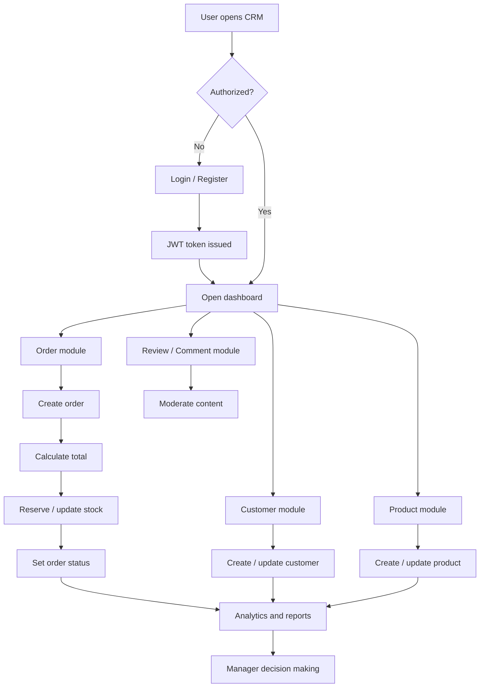

# Technical Specification  
## CRM System for a Stationery Store

---

## 1. Project Overview

**Project Name:** Stationery Store CRM  
**Purpose:**  
To develop a CRM system for managing customers, products, orders, and inventory in a stationery business.

**Business Type:**  
- Retail  
- Wholesale  

---

## 2. System Modules

---

## 2.1 Customer Management Module

### Description
This module manages customer information and purchase history.

### Functional Requirements
- Add a new customer  
- Edit customer information  
- Delete a customer  
- View customer details  
- View customer order history  
- Search and filter customers  

### Customer Fields
- Full Name / Company Name  
- Phone Number  
- Email  
- Address  
- Customer Type (Retail / Wholesale)  

---

## 2.2 Product Management Module

### Description
This module manages stationery products and stock levels.

### Functional Requirements
- Add new product  
- Edit product  
- Delete product  
- View product list  
- Track stock quantity  
- Show low stock warning  

### Product Fields
- Product Name  
- SKU  
- Category  
- Price  
- Quantity in Stock  

### Product Categories

- Pens  
- Notebooks  
- Folders  
- Pencils  
- Paper  

---

## 2.3 Order Management Module

### Description
This module handles customer orders and sales processing.

### Functional Requirements
- Create new order  
- Select customer  
- Add products to order  
- Automatic total price calculation  
- Update order status  

### Order Statuses
- New  
- Confirmed  
- Completed  
- Cancelled  

### Order Fields
- Order ID  
- Customer  
- Order Date  
- Product List  
- Total Amount  
- Status  

---

## 2.4 Inventory Module

### Description
This module manages stock control and updates.

### Functional Requirements
- Automatic stock deduction after order completion  
- Display current stock levels  
- Low stock notification  

---

## 3. User Roles

### Administrator
- Full system access  
- Manage users  

### Manager
- Manage customers  
- Create and manage orders  
- View products  

---

## 4. Non-Functional Requirements

- Web-based application  
- User-friendly interface  
- Database support 
- Secure authentication system  
- Response time under 3 seconds  

---

## 5. Expected Result

The CRM system should allow the stationery business to:

- Maintain customer database  
- Manage inventory  
- Process and track orders  
- Monitor sales activity  

---

## 6. Core Flowchart



---

## 7. API Response Status Standard (Custom)

To keep API responses consistent, introduce a custom response status layer on top of HTTP statuses.

### ResponseStatus values
- `SUCCESS` — operation completed successfully.
- `FAIL` — operation failed due to validation or business rules.
- `ERROR` — unexpected server-side failure.

### Recommended payload format

```json
{
  "status": "SUCCESS",
  "message": "User successfully registered",
  "data": null,
  "timestamp": "2026-02-27T12:00:00"
}
```

### Mapping guideline
- HTTP `2xx` -> `SUCCESS`
- HTTP `4xx` -> `FAIL`
- HTTP `5xx` -> `ERROR`
